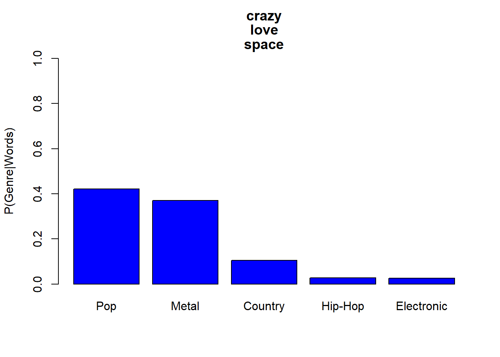

# Applied Data Science @ Columbia
## Fall 2019
## Project 1: A "data story" on the songs of our times



### [Project Description](doc/)
This is the first and only *individual* (as opposed to *team*) this semester. 

Term: Fall 2019

+ Project title: Conditioning Our Expectations: Genre Uniqueness 
+ This project is conducted by Sam Unger

+ Project summary: This report was created with the goal of investigating which lyrics really set apart one genre from another. First, we process the raw "lyrics.RData" file and save the cleaned song data in the output folder as "processed_lyrics.RData". Then we use a few functions that I created (documented in the lib folder) to measure the popularity of certain words (in particular, certains groups of words) across genres, before calculating some conditional probabilities and depicting those different probabilities between genres graphically. We'll see that having just a couple specific keywords in a lyric almost guarantees that song is of a certain genre!

Following [suggestions](http://nicercode.github.io/blog/2013-04-05-projects/) by [RICH FITZJOHN](http://nicercode.github.io/about/#Team) (@richfitz). This folder is organized as follows.

```
proj/
├── lib/
├── data/
├── doc/
├── figs/
└── output/
```

Please see each subfolder for a README file.
